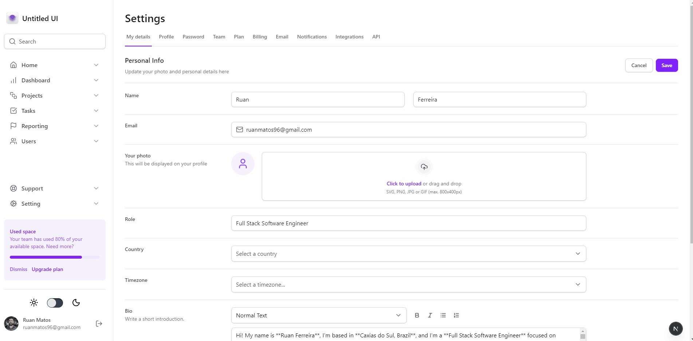

# Tailwind Profile Page

<p align="left">        </p>

A modern and animated profile page built with Next.js, TypeScript, and styled primarily with Tailwind CSS.
The project also leverages Radix UI, Framer Motion, and Lucide React to deliver an accessible, smooth, and visually elegant experience.

## Preview



# Installation

```bash
git clone https://github.com/SirRuanMatos/TailwindProfilePage.git
cd TailwindProfilePage
npm install
# or
yarn
# or
pnpm install
# or
bun install
```


# Running the Project
```bash
npm run dev
# or
yarn dev
# or
pnpm dev
# or
bun dev
```

Then open:  [http://localhost:3000](http://localhost:3000) with your browser to see the result.

# Features
 - Responsive layout powered by Tailwind CSS
 - Smooth transitions and animations with Framer Motion
 - Accessible UI primitives from Radix UI
 - Consistent iconography using Lucide React
 - Fully typed components using TypeScript